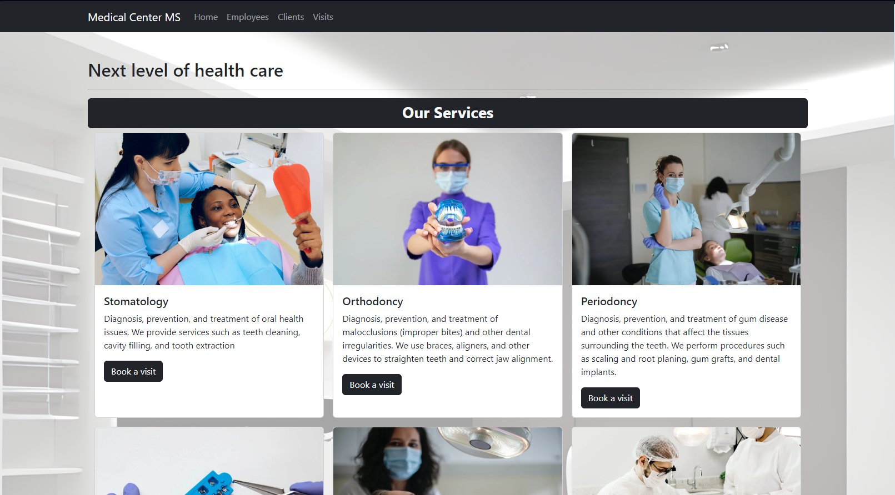
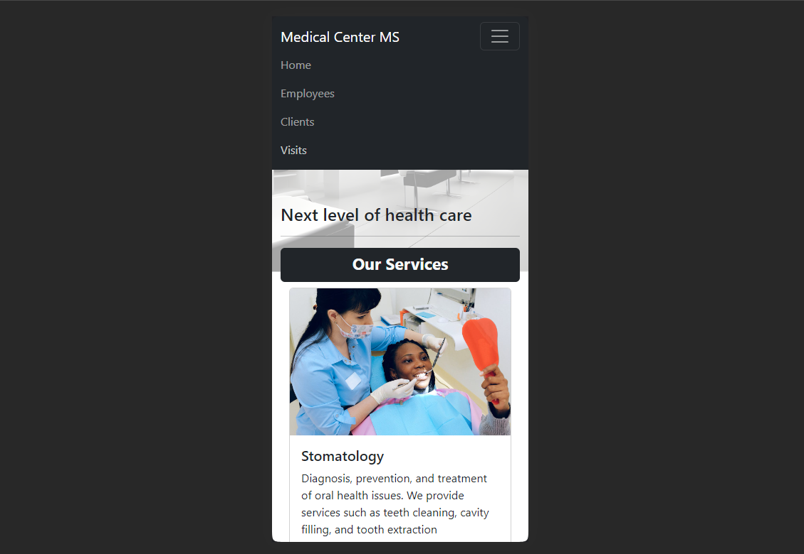

# Visit Reservation Application (In progress)

### It is a spring boot app that provides REST API. Application is connected to Postgres database.
#### Stack: Spring boot, PostgreSql, Spring MVC, Thymeleaf 

## Functionalities:
- Booking and deleting operations on visits as Client
- Searching for available visits
- CRUD operations on visits as Employee
- Managing employees and clients as Admin
- Verifying user email
- Authentication (Employee, Admin)

## Screenshots

### Home

### Home - mobile

### Home - gif

## How To Run*
*Requires PostgresSQL Server
1. Download and unzip the source repository for this guide, or clone it using Git: 
git clone (https://github.com/BartoszTanski/VisitReservation)https://github.com/BartoszTanski/VisitReservation
2. Import project to your IDE
3. Change project properties in /src/main/resources/application.yaml:
postgres username and password
postgres database url
4. Run VisitReservationApplication.java as Java application

